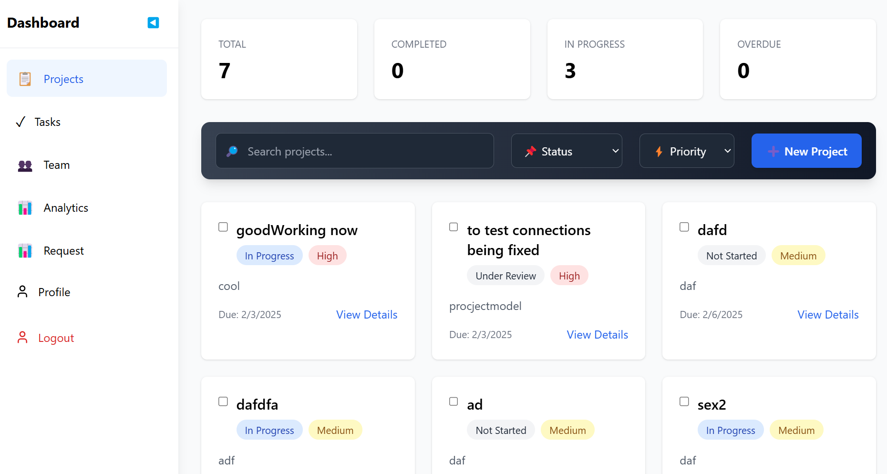
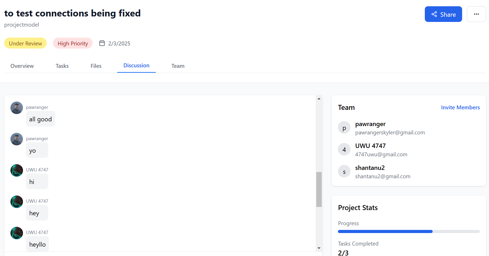

# ***_STREAMLINE_*** - *Team Collaboration and Project Management Platform*


🚀 Welcome to **STREAMLINE** – your ultimate solution for **boosting productivity 📈, enhancing collaboration 🤝, and achieving more with less effort ⚡.**
## About ***STREAMLINE*** -

🚀 **STREAMLINE** is a powerful **productivity platform** designed to help teams **manage tasks ✅, collaborate in real-time 💬, and automate workflows ⚙️ effortlessly**. Whether you're a **small team 👥** or a **large organization 🏢**, STREAMLINE adapts to your needs, ensuring **productivity 📈 and success 🏆** at every step!
## ***Features***

- Task Management: Create, assign, and track tasks effortlessly.
- Real-Time Collaboration: Chat, share files, and collaborate in real-time.
- Smart Automation: Automate repetitive tasks to save time.
- Customizable Dashboards: Tailor your workspace to suit your workflow.
- Advanced Analytics: Gain insights into team performance and project progress.
- AI Powered Milestone Tracker: Gain insights over your project to decide the current status of the project in terms of a bar respresenting the status of project completion

**Upcoming Features** 

- AI Agents: Revolutionary AI agents that streamline workflows, automate repetitive tasks, and provide intelligent suggestions for optimal project management.
- Smart Task & Deadline Tracking: Intelligent system that prioritizes tasks, predicts potential delays, and ensures project milestones are met consistently.
Discussion Hub: Centralized communication platform with threaded discussions, real-time updates, and smart notification filtering for focused collaboration.
- AI Project Scheduler: Smart scheduling system that syncs with Google Calendar, analyzes team availability, and suggests optimal meeting times automatically.
- Smart Tagging: AI-powered tagging system that automatically categorizes content, making information retrieval lightning-fast and intuitive.
- Team Analytics: Comprehensive team performance analytics with burnout prevention indicators and productivity optimization suggestions.
- Collaboration Insights: Deep dive into collaboration patterns with AI-generated insights for improving team dynamics and project outcomes.
- Project Merging: Seamlessly combine multiple projects while maintaining data integrity and resolving conflicts intelligently.
Smart Meeting Planner: AI-powered meeting scheduler with automatic agenda generation and post-meeting action item tracking.
- Brainstorming Hub: Virtual workspace for creative collaboration with AI-assisted idea generation and organization tools.
- Smart Storage: Intelligent file management system with version control, automatic categorization, and predictive file retrieval.
- Quick Notes: Context-aware note-taking system that automatically links related content and suggests relevant team members to collaborate.


## ***Getting Started***

To get started with this project follow the setup instructions provided below.


## ```Installation```
To get started with STREAMLINE, follow these steps:

1. **Clone the repository**:
   ```bash
   git clone https://github.com/your-username/STREAMLINE.git


2. **Navigate to the project directory:**
   ```bash
   cd STREAMLINE

3. **Install Dependencies:**
   ```bash
   npm Install

4. **Run the Application:**
   ```bash
   npm start


## ***Deployment***

To deploy this project run

```bash
  npm run dev
```
 or 
```bash
  yarn dev
```
Dependencies Overview
Backend Dependencies:
@vercel/blob: Blob storage utility for file handling.
axios: Promise-based HTTP client for making API requests.
bcryptjs: Library for hashing passwords securely.
cloudinary: Cloud-based media management service for storing images and videos.
cookie-parser: Middleware for parsing cookies.
cors: Middleware for enabling Cross-Origin Resource Sharing.
dotenv: Loads environment variables from a .env file.
express: Fast, unopinionated web framework for Node.js.
express-session: Middleware for managing session data.
google-auth-library: For integrating Google OAuth.
jsonwebtoken: For working with JSON Web Tokens (JWT) for authentication.
mongoose: ODM (Object Data Modeling) library for MongoDB.
multer: Middleware for handling file uploads.
nodemailer: Module for sending emails from Node.js.
nodemon: Tool that monitors for file changes in the backend and automatically restarts the server.
passport: Authentication middleware for Node.js.
passport-google-oauth20: Strategy for integrating Google OAuth2.0.
socket.io: For real-time bidirectional communication.
ws: WebSocket library for WebSocket connections.


Frontend Dependencies:
axios: For making HTTP requests to the backend.
framer-motion: For animations in React.
js-cookie: For handling cookies in the browser.
lucide-react: Icon library for React.
react: Library for building user interfaces.
react-dom: React package for web rendering.
react-router-dom: Library for handling navigation and routing in React.
socket.io-client: For connecting to the real-time Socket.io server.

install all the dependensies 
use -  npm run server to run the server make sure the server runs on port 5000

to run the frontend 
use - npm run dev (make sure the frontend runs on the prot 5173)


## ***Contributing***

Contributions are always welcome!

See `contributing.md` for ways to get started.

Please adhere to this project's `code of conduct`.

1. Fork the repository.
2. Create a new branch (`git checkout -b feature/YourFeatureName`).
3. Commit your changes (`git commit -m 'Add some feature'`).
4. Push to the branch (`git push origin feature/YourFeatureName`).
5. Open a pull request.

## Screenshots





